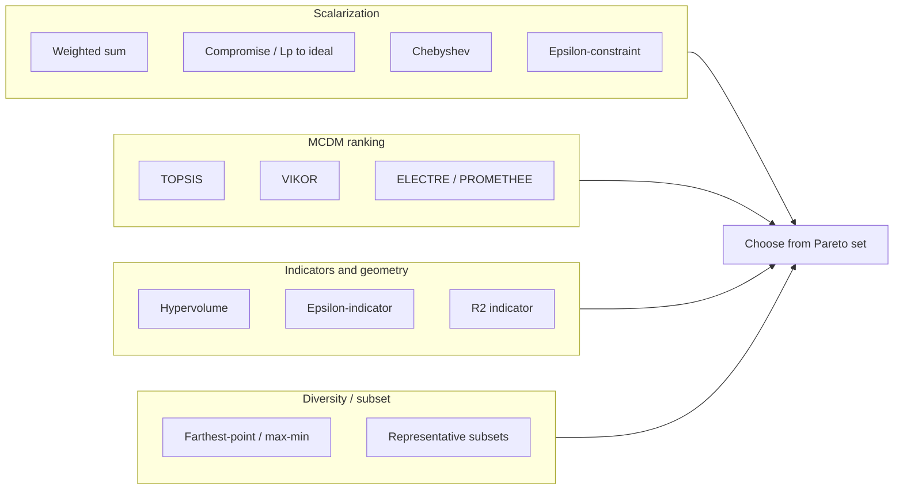

# Pareto set selection: background and literature

This note summarizes common methods for *choosing* or *prioritizing* solutions from a Pareto (nondominated) set in multi-objective optimization, with primary citations. It complements the implementation in `methods/plotting/pick_labels.py` and `methods/plotting/selection_unified.py`, where several of these ideas appear as named “picks” (scalarizations, ε-constraints, knee, diversity, hypervolume contribution).

---

## Executive summary

Multi-objective optimization often yields a *set* of nondominated solutions rather than a single answer. **Selection** from that set can be done by:

- **Scalarization** — collapse objectives into one criterion (weighted sum, Chebyshev / $L_\infty$, $L_p$ distance to an ideal point, ε-constraints).
- **MCDM / utility-style rules** — rank alternatives (TOPSIS, VIKOR, outranking, AHP, etc.).
- **Indicators and geometric structure** — prefer points with large hypervolume contribution, high curvature (“knee”), or well-spread subsets.
- **Diversity** — subsample points that are far apart in objective space (e.g. farthest-point / max–min distance ideas from clustering).

The tables below give **foundational references** (original or standard sources where possible). Citations use APA-style entries with DOIs where available.

---

## Methods aligned with this codebase (quick map)

| Idea in code | Typical literature anchor |
|--------------|---------------------------|
| Minimum Euclidean ($L_2$) / Manhattan ($L_1$) / weighted Chebyshev distance to IP | Compromise programming ($L_p$ to ideal): Zeleny (1974); Chebyshev scalarization for Pareto sampling: Steuer & Choo (1983) |
| ε-constraint (feasible on one objective, optimize another) | Haimes et al. (1971) |
| Normalized equal-weight mean over objectives | Related to scalarization / equal weights; see weighted-sum foundations (Zadeh, 1963) and compromise frameworks (Zeleny, 1974) |
| Knee / maximum curvature (2D) | Normal-boundary and knee ideas: e.g. Das & Dennis (1998) NBI; knee selection discussed widely in MOO |
| Farthest-point style diversity in normalized objective space | Greedy max–min distance: González (1985) (k-center / farthest insertion) |
| Hypervolume contribution (2D nondominated front) | Hypervolume indicator: Zitzler & Thiele (1998); see also Zitzler et al. (2000) for ε-indicator family |

---

## Core methods and key references

| Method | Key reference (APA) | Rationale |
|--------|---------------------|-----------|
| Weighted sum (linear scalarization) | Zadeh, L. A. (1963). Optimality and non-scalar-valued performance criteria. *IEEE Transactions on Automatic Control*, *8*(1), 59–60. https://doi.org/10.1109/TAC.1963.1105511 | Early formal use of weighted sums; Pareto-optimal solutions under convexity assumptions. |
| ε-constraint method | Haimes, Y. Y., Lasdon, L. S., & Wismer, D. A. (1971). On a bicriterion formulation of the problems of integrated system identification and system optimization. *IEEE Transactions on Systems, Man, and Cybernetics*, *SMC-1*(3), 296–297. https://doi.org/10.1109/TSMC.1971.4308298 | Classic formulation: optimize one objective subject to bounds on others. |
| Compromise programming ($L_p$ distance to ideal) | Zeleny, M. (1974). A concept of compromise solutions and the method of the displaced ideal. *Computers & Operations Research*, *1*(3–4), 479–496. https://doi.org/10.1016/0305-0548(74)90064-1 | Defines compromise solutions via distance to an ideal point in objective space. |
| Weighted Chebyshev / Pareto sampling | Steuer, R. E., & Choo, E. U. (1983). An interactive weighted Tchebycheff procedure for multiple objective programming. *Mathematical Programming*, *26*(3), 326–344. https://doi.org/10.1007/BF02591870 | Weighted Chebyshev scalarization to obtain Pareto-relevant solutions. |
| TOPSIS | Hwang, C. L., & Yoon, K. (1981). *Multiple Attribute Decision Making: Methods and Applications*. Springer. | Ranks alternatives by closeness to ideal and distance from nadir; widely used in MCDM. |
| Farthest-first / max–min diversity | González, T. F. (1985). Clustering to minimize the maximum intercluster distance. *Theoretical Computer Science*, *38*, 293–306. https://doi.org/10.1016/0304-3975(85)90224-5 | Greedy farthest-point selection; related to $k$-center clustering (spread in metric space). |
| Hypervolume ($S$-metric) | Zitzler, E., & Thiele, L. (1998). Multiobjective optimization using evolutionary algorithms—A comparative case study. In A. E. Eiben *et al.* (Eds.), *Parallel Problem Solving from Nature—PPSN V* (LNCS Vol. 1498, pp. 292–301). Springer. https://doi.org/10.1007/BFb0056872 | Hypervolume as quality indicator for Pareto sets in evolutionary MOO. |

---

## Broader chronological context (selected milestones)

| Period | Method / idea | Reference |
|--------|----------------|-----------|
| 1906 | Pareto efficiency (economic origins) | Pareto, V. (1906). *Manuel d’économie politique*. |
| 1963 | Weighted-sum scalarization | Zadeh (1963), above |
| 1968 | ELECTRE (outranking) | Roy, B. (1968). *RIRO*, *2*(8), 57–75. |
| 1971 | ε-constraint | Haimes et al. (1971), above |
| 1974 | Compromise programming | Zeleny (1974), above |
| 1976 | MAUT | Keeney, R. L., & Raiffa, H. (1976). *Decisions with Multiple Objectives*. Wiley. |
| 1977 | Goal programming (survey/formulation) | Charnes, A., & Cooper, W. W. (1977). Goal programming and multiple objective optimization—Part I. *European Journal of Operational Research*, *1*(1), 39–54. |
| 1980 | AHP | Saaty, T. L. (1980). *The Analytic Hierarchy Process*. McGraw-Hill. |
| 1981 | TOPSIS | Hwang & Yoon (1981), above |
| 1983 | Interactive weighted Tchebycheff | Steuer & Choo (1983), above |
| 1984 | PROMETHEE | Brans, J. P., & Vincke, P. (1985). Note—A preference ranking organisation method. *Management Science*, *31*(6), 647–656. |
| 1985 | Farthest-point ($k$-center) | González (1985), above |
| 1988 | OWA operators | Yager, R. R. (1988). On ordered weighted averaging aggregation operators. *Fuzzy Sets and Systems*, *27*(2), 183–206. |
| 1995 | NIMBUS (interactive) | Miettinen, K., & Mäkelä, M. M. (1995). Interactive bundle-based method for nondifferentiable multiobjective optimization: Nimbus. *Optimization*, *34*(3), 231–246. |
| 1998 | Hypervolume indicator | Zitzler & Thiele (1998), above |
| 1998 | R2 indicator | Hansen, M. P., & Jaszkiewicz, A. (1998). Evaluating the quality of approximations to the non-dominated set. *IMM Technical Report*, Technical University of Denmark. |
| 2001 | NBI / knee-related trade-offs | Das, I., & Dennis, J. E. (1998). Normal-boundary intersection: A new method for generating the Pareto surface in nonlinear multicriteria optimization problems. *SIAM Journal on Optimization*, *8*(3), 631–657. |

---

## Method families (conceptual)



---

## Discussion and practical guidance

- **Scalarization** (weighted sum, $L_p$ or Chebyshev distance to an ideal point, ε-constraint) is computationally light and easy to explain, but weighted sums can miss parts of the front if the front is nonconvex; ε-constraints and Chebyshev-type scalarizations are standard fixes.
- **Reference-point and MCDM methods** (TOPSIS, VIKOR, interactive methods such as NIMBUS) make decision-maker preferences explicit when trade-off information exists.
- **Indicators** (hypervolume, ε-indicator, R2) summarize set quality or help select points that improve coverage; they are especially common in evolutionary multi-objective optimization.
- **Diversity** (farthest-point, clustering, representative subsets) helps avoid choosing nearly duplicate solutions when reporting several alternatives.

For this project’s **automated picks** (without an interactive decision maker), scalarizations, ε-constraints, knee heuristics, farthest-point diversity, and hypervolume contribution are natural *post hoc* summaries—not a substitute for domain-specific preference, but useful for visualization and cross-run comparison.

---

## References (APA)

Brans, J. P., & Vincke, P. (1985). Note—A preference ranking organisation method: The PROMETHEE method for MCDM. *Management Science*, *31*(6), 647–656.

Charnes, A., & Cooper, W. W. (1977). Goal programming and multiple objective optimization—Part I. *European Journal of Operational Research*, *1*(1), 39–54.

Das, I., & Dennis, J. E. (1998). Normal-boundary intersection: A new method for generating the Pareto surface in nonlinear multicriteria optimization problems. *SIAM Journal on Optimization*, *8*(3), 631–657.

González, T. F. (1985). Clustering to minimize the maximum intercluster distance. *Theoretical Computer Science*, *38*, 293–306. https://doi.org/10.1016/0304-3975(85)90224-5

Haimes, Y. Y., Lasdon, L. S., & Wismer, D. A. (1971). On a bicriterion formulation of the problems of integrated system identification and system optimization. *IEEE Transactions on Systems, Man, and Cybernetics*, *SMC-1*(3), 296–297. https://doi.org/10.1109/TSMC.1971.4308298

Hansen, M. P., & Jaszkiewicz, A. (1998). Evaluating the quality of approximations to the non-dominated set. *IMM Technical Report*.

Hwang, C. L., & Yoon, K. (1981). *Multiple Attribute Decision Making: Methods and Applications*. Springer.

Keeney, R. L., & Raiffa, H. (1976). *Decisions with Multiple Objectives: Preferences and Value Tradeoffs*. Wiley.

Miettinen, K., & Mäkelä, M. M. (1995). Interactive bundle-based method for nondifferentiable multiobjective optimization: Nimbus. *Optimization*, *34*(3), 231–246.

Pareto, V. (1906). *Manuel d’économie politique* [Manual of political economy].

Roy, B. (1968). Classement et choix en présence de points de vue multiples (la méthode ELECTRE). *Revue française d’informatique et de recherche opérationnelle*, *2*(8), 57–75.

Saaty, T. L. (1980). *The Analytic Hierarchy Process: Planning, Priority Setting, Resource Allocation*. McGraw-Hill.

Steuer, R. E., & Choo, E. U. (1983). An interactive weighted Tchebycheff procedure for multiple objective programming. *Mathematical Programming*, *26*(3), 326–344. https://doi.org/10.1007/BF02591870

Yager, R. R. (1988). On ordered weighted averaging aggregation operators in multicriteria decisionmaking. *Fuzzy Sets and Systems*, *10*(1), 93–103.

Zadeh, L. A. (1963). Optimality and non-scalar-valued performance criteria. *IEEE Transactions on Automatic Control*, *8*(1), 59–60. https://doi.org/10.1109/TAC.1963.1105511

Zeleny, M. (1974). A concept of compromise solutions and the method of the displaced ideal. *Computers & Operations Research*, *1*(3–4), 479–496. https://doi.org/10.1016/0305-0548(74)90064-1

Zitzler, E., Deb, K., & Thiele, L. (2000). Comparison of multiobjective evolutionary algorithms: Empirical results. *Evolutionary Computation*, *8*(2), 173–195.

Zitzler, E., & Thiele, L. (1998). Multiobjective optimization using evolutionary algorithms—A comparative case study. In A. E. Eiben *et al.* (Eds.), *Parallel Problem Solving from Nature—PPSN V* (LNCS Vol. 1498, pp. 292–301). Springer. https://doi.org/10.1007/BFb0056872

---

## BibTeX (selected)

```bibtex
@article{Zadeh1963,
  author  = {Zadeh, Lotfi A.},
  title   = {Optimality and non-scalar-valued performance criteria},
  journal = {IEEE Transactions on Automatic Control},
  year    = {1963},
  volume  = {8},
  number  = {1},
  pages   = {59--60},
  doi     = {10.1109/TAC.1963.1105511}
}

@article{Haimes1971,
  author  = {Haimes, Yacov Y. and Lasdon, Leon S. and Wismer, David A.},
  title   = {On a bicriterion formulation of the problems of integrated system identification and system optimization},
  journal = {IEEE Transactions on Systems, Man, and Cybernetics},
  year    = {1971},
  volume  = {SMC-1},
  number  = {3},
  pages   = {296--297},
  doi     = {10.1109/TSMC.1971.4308298}
}

@article{Zeleny1974,
  author  = {Zeleny, Milan},
  title   = {A concept of compromise solutions and the method of the displaced ideal},
  journal = {Computers \& Operations Research},
  year    = {1974},
  volume  = {1},
  number  = {3-4},
  pages   = {479--496},
  doi     = {10.1016/0305-0548(74)90064-1}
}

@book{Hwang1981,
  author    = {Hwang, Ching-Lai and Yoon, Kwangsun},
  title     = {Multiple Attribute Decision Making: Methods and Applications},
  year      = {1981},
  publisher = {Springer},
  address   = {Berlin}
}

@article{Gonzalez1985,
  author  = {Gonz{\'a}lez, Teofilo F.},
  title   = {Clustering to minimize the maximum intercluster distance},
  journal = {Theoretical Computer Science},
  year    = {1985},
  volume  = {38},
  pages   = {293--306},
  doi     = {10.1016/0304-3975(85)90224-5}
}

@incollection{Zitzler1998,
  author    = {Zitzler, Eckart and Thiele, Lothar},
  title     = {Multiobjective optimization using evolutionary algorithms---A comparative case study},
  booktitle = {Parallel Problem Solving from Nature---PPSN V},
  series    = {Lecture Notes in Computer Science},
  volume    = {1498},
  pages     = {292--301},
  year      = {1998},
  publisher = {Springer},
  doi       = {10.1007/BFb0056872}
}

@article{SteuerChoo1983,
  author  = {Steuer, Ralph E. and Choo, Eng-Ung},
  title   = {An interactive weighted {Tchebycheff} procedure for multiple objective programming},
  journal = {Mathematical Programming},
  year    = {1983},
  volume  = {26},
  number  = {3},
  pages   = {326--344},
  doi     = {10.1007/BF02591870}
}
```

---

## Appendix: literature search notes

Useful search strings included: “ε-constraint Haimes 1971”, “compromise programming Zeleny 1974”, “hypervolume Zitzler Thiele 1998”, “weighted Tchebycheff Steuer Choo 1983”, “farthest point clustering González 1985”. Prefer **primary** articles and standard textbooks for definitions; use reviews for breadth.
